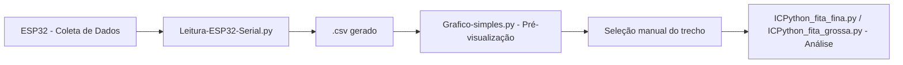

# 📂 Pasta `src` — Código-Fonte Principal

Esta pasta contém todos os scripts e programas relacionados à **aquisição, tratamento e análise dos dados** de velocidade capturados pela ESP32.  
Os arquivos aqui foram organizados para representar o fluxo completo: desde a leitura dos sinais brutos até a análise detalhada das amostras.

---

## ⚙️ Estrutura dos Arquivos

### 🧩 `Envio-ESP32-Serial.cpp`
Código desenvolvido para o **microcontrolador ESP32**, responsável por:
- Ler o sinal analógico via **ADC**;
- Realizar o envio serial dos dados em tempo real;
- Implementar temporização estável e tratamento de buffer;
- Facilitar a depuração por meio de mensagens e logs.

Esse código é o ponto de partida da captura dos sinais físicos.

---

### 💻 `Leitura-ESP32-Serial.py`
Script Python responsável por:
- Ler os dados recebidos via **porta serial**;
- Salvar as amostras em um **arquivo .csv** para posterior análise;
- Permitir a escolha dinâmica da porta e taxa de amostragem;
- Exibir informações básicas sobre o fluxo de dados durante a aquisição.

Esse arquivo faz a ponte entre o microcontrolador e o ambiente de análise.

---

### 📊 `Grafico-simples.py`
Ferramenta inicial de visualização dos dados brutos.  
Permite uma inspeção rápida do sinal e auxilia na verificação de:
- Estrutura temporal;
- Presença de **jitter**;
- Integridade e continuidade das amostras.

Também ajuda a identificar os **trechos válidos** do sinal que serão separados em arquivos `.txt` para análises detalhadas.

---

### 🚀 `ICPython_fita_fina.py`
Script de análise completa voltado para sinais de **velocidade constante**.  
Aplica filtros, processa o sinal e extrai parâmetros como:
- Velocidade média;
- Frequência dominante;
- FFT e gráficos refinados de comportamento dinâmico.

Ideal para sinais capturados em **fitas finas** ou medições de baixa inércia.

---

### 🧠 `ICPython_fita_grossa.py`
Versão otimizada para análise de **fitas grossas** ou medições com **velocidade variável**.  
Possui:
- Filtros mais suaves para evitar distorção;
- Interpolação para aumento de amostragem e precisão nos cálculos;
- Gráficos comparativos entre métodos de análise.

Destina-se a experimentos com maior complexidade dinâmica.

---

## 🧭 Fluxo de Trabalho Recomendo

---

## 📘 Notas Finais
- Todos os scripts estão comentados e organizados para fácil adaptação.  
- É recomendável manter o mesmo formato de nomes e pastas para compatibilidade.  
- Novos módulos de análise podem ser adicionados nesta pasta mantendo o padrão de documentação.

---
📅 **Última atualização:** Outubro de 2025  
👤 **Autor:** Luis Felipe Pereira Ramos
